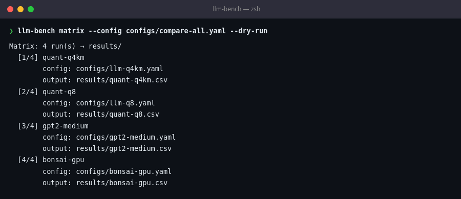
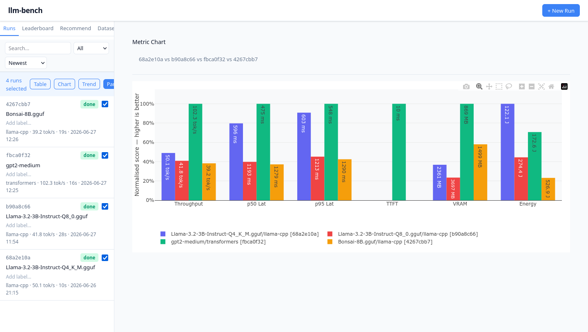
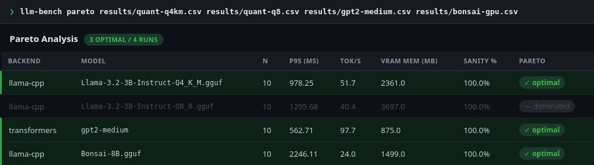
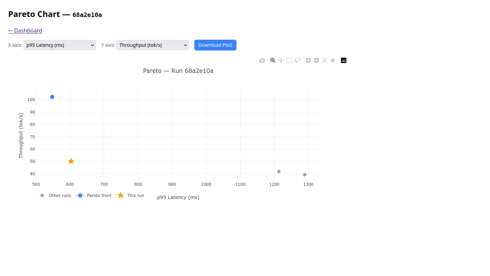
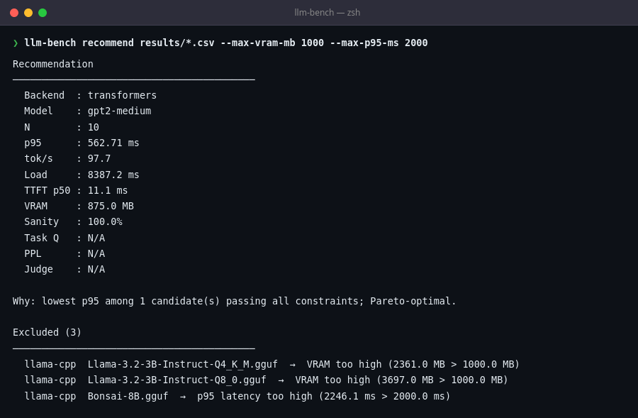
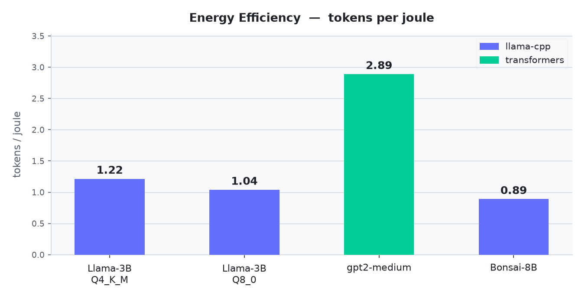

# RTX 3050 Laptop — 4-Model Backend Comparison

**Date**: 2026-06-27
**Hardware**: i5-11400H + NVIDIA GeForce RTX 3050 Laptop GPU (4 GB VRAM)
**Branch**: `main` (v1.8.1)

## Purpose

Compare two backends (llama-cpp, transformers) and four model configurations on a
constrained 4 GB laptop GPU. Goals:

1. Establish current Pareto front across throughput, latency, VRAM, and energy efficiency.
2. Validate `tokens_per_joule` collection across both backends.
3. Exercise the `matrix`, `pareto`, and `recommend` CLI commands with real models.

## Hardware

| Component | Value |
|-----------|-------|
| CPU | 11th Gen Intel Core i5-11400H @ 2.70 GHz, 6 cores / 12 threads |
| RAM | 14.8 GB |
| GPU | NVIDIA GeForce RTX 3050 Laptop GPU |
| VRAM | 4096 MiB |
| Driver / CUDA | CUDA 13.x (cu124 wheel, no nvcc) |
| OS | Linux 7.0.0-27-generic x86-64 |

## Software

| Component | Version |
|-----------|---------|
| Python | 3.12.13 |
| llama-cpp-python | pre-built cu124 wheel |
| transformers | 5.x |
| torch | 2.x, CUDA 12.x |

## Models and Configs

| Run name | Model | Backend | Key settings |
|---|---|---|---|
| `quant-q4km` | Llama-3.2-3B-Instruct-Q4\_K\_M.gguf | llama-cpp | `n_gpu_layers=99`, `n_ctx=512` |
| `quant-q8` | Llama-3.2-3B-Instruct-Q8\_0.gguf | llama-cpp | `n_gpu_layers=99`, `n_ctx=512` |
| `gpt2-medium` | gpt2-medium (345 M params, HF Hub) | transformers | `device=cuda`, `float16` |
| `bonsai-gpu` | Bonsai-8B.gguf | llama-cpp | `n_gpu_layers=99`, `n_ctx=512` |

Shared: `requests=10`, `warmup_requests=2`, `max_tokens=50`, `temperature=0.0` (greedy),
`prompts_file=data/prompts/smoke.txt`.

Run via matrix config:

```bash
llm-bench matrix --config configs/compare-all.yaml --dry-run  # preview
llm-bench matrix --config configs/compare-all.yaml            # execute
```



## Results

| Model | Backend | p50 (ms) | p95 (ms) | tok/s | VRAM (MiB) | tok/J | Sanity |
|---|---|---|---|---|---|---|---|
| Llama-3.2-3B Q4\_K\_M | llama-cpp | 968 | 978 | 51.7 | 2361 | 1.22 | 100% |
| Llama-3.2-3B Q8\_0 | llama-cpp | 1217 | 1296 | 40.4 | 3697 | 1.04 | 100% |
| **gpt2-medium** | **transformers** | **501** | **563** | **97.7** | **875** | **2.89** | **100%** |
| Bonsai-8B | llama-cpp | 2229 | 2246 | 24.0 | 1499 | 0.89 | 100% |



## Pareto Analysis

```bash
llm-bench pareto results/quant-q4km.csv results/quant-q8.csv \
                  results/gpt2-medium.csv results/bonsai-gpu.csv
```

3 of 4 runs are Pareto-optimal — no single configuration dominates all others across
throughput, latency, VRAM, and energy simultaneously.





## Constraint-Based Recommendation

```bash
llm-bench recommend results/quant-q4km.csv results/quant-q8.csv \
                    results/gpt2-medium.csv results/bonsai-gpu.csv \
  --max-vram-mb 1000 --max-p95-ms 2000 --min-sanity 1.0
```

With a 1 GB VRAM budget, only gpt2-medium qualifies. The three llama-cpp runs are shown
as excluded with the specific reason for each.



## Energy Efficiency

`tokens_per_joule` collected via `nvidia-smi power.draw` polling (0.5 s interval).
gpt2-medium leads at 2.89 tok/J — a 345 M parameter model generates more tokens per watt
because it saturates GPU compute without filling memory bandwidth. Larger GGUF models
spend proportionally more time on memory-bound operations.



> **Caveat**: `nvidia-smi power.draw` measures whole-GPU power, not per-process.
> Numbers are valid only for isolated single-process runs (no other GPU workloads).

## Interpretation

- **gpt2-medium** leads on every throughput and efficiency metric but is a 345 M parameter
  base model — output quality is not comparable to the instruction-tuned Llama/Bonsai runs.
- **Q4\_K\_M** is the best llama-cpp option: fastest and most VRAM-efficient of the three
  GGUF models, Pareto-optimal.
- **Bonsai-8B** fits in 1.5 GB VRAM (GPU-quantised 8B model) at the cost of highest latency.
- **Q8\_0** is dominated by Q4\_K\_M on all measured axes — higher VRAM, lower throughput,
  worse energy efficiency — and is the only non-Pareto-optimal run.

## Reproducibility

```bash
git clone https://github.com/Happynood/llm-inference-benchmark
cd llm-inference-benchmark
uv sync --extra llama-cpp --extra transformers
make install-llama-cpp-prebuilt  # GPU wheel + runtime symlinks

# Download models
llm-bench pull bartowski/Llama-3.2-3B-Instruct-GGUF --quant Q4_K_M
llm-bench pull bartowski/Llama-3.2-3B-Instruct-GGUF --quant Q8_0
# gpt2-medium downloads automatically from HF Hub on first run
# Bonsai-8B.gguf — download manually and adjust path in config

llm-bench matrix --config configs/compare-all.yaml
llm-bench pareto results/quant-q4km.csv results/quant-q8.csv \
                 results/gpt2-medium.csv results/bonsai-gpu.csv
```
